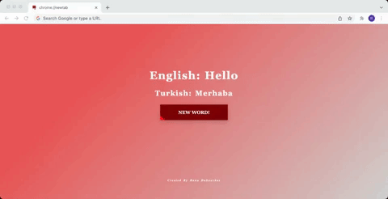

# TurkDict - A Google Chrome Extension

This is a google chrome extension that replaces the default tab screen with English-Turkish translations to improve language fluency

## Demonstration

## Built With

  - JavaScript
  - HTML
  - CSS
  - React JS

## Installation

- Go to chrome://extensions/ and check the box for Developer mode in the top right.
- Download and unzip the folder and click "Load unpacked"
- Activate the extension

## Development

Since Chrome apis cannot be used outside extension scope (`chrome-extension://`) you cannot run the app as you would normally do with a react application.

- Go to `chrome://extensions/` and check the box for Developer mode in the top right.
- Fork the repo and clone it locally
- Install dependencies with `npm install`.
- Do a build first with `npm run build`
- Run `npm run start`
- In another shell tab run `npm run watch`
- Open extensions tab in google chrome
- Drag and drop the `build` folder into extensions tab
- Activate the extension
- Start coding

Every time you make a change inside the `src` folder `npm run watch` will make a new build and you just need to refresh the tab for see changes.

## Author

  - **Rana Dubauskas** - *Developed the app* -
    [ranadubauskas](https://github.com/ranadubauskas)

